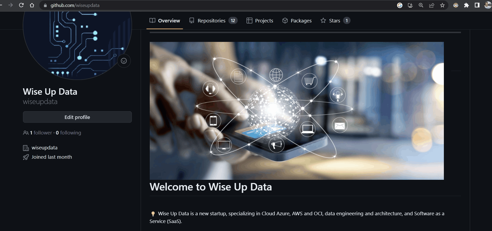

Easy create a Data Lake / Delta Lake!

--- 

<a href="https://github.com/wiseupdata/wiseupdata">
     
</a> 
<a href="https://github.com/wiseupdata/wiseupdata">
  
</a>
<a href="https://github.com/wiseupdata/wiseupdata">
  
</a>
<a href="https://github.com/wiseupdata/wiseupdata">
  
</a>


---

<h1>


Module - Create a Data Lake / Delta Lake 🚀️

</h1>
Last version tested | Terraform 4.1 and oci 4.115

## Simple config. ❤️

main.tf
```
module "datalake" {
  source           = "wiseupdata/datalake/oci"
  version          = "0.0.1"
  bucket_namespace = var.bucket_namespace
  tenancy_ocid     = var.tenancy_ocid
}
```

## Features ✨️

- Auto-generated tags
- Auto-generated the compartment
- Apply's the Standard, environment as suffix
- Variables are optionals and can be overwrite with a custom value

## Create the resources🤜

```
terraform init
terraform fmt -recursive
terraform validate
terraform plan -out plan.output
terraform apply plan.output
```

Check the result🏅

---



---

# Clean the resources 🏳

```
terraform destroy -auto-approve
cd ..
rm -Rf tmp
```

<br>
<br>

# References🤘

1. [Wise Up Data - Github](https://github.com/wiseupdata)

---

<br>


<br><br>
---

#### Maintainer 🤗 👨‍💻

Sivio Liborio

📧 silvio.liborio@wiseupdata.com

<a href="https://www.linkedin.com/in/silvio-de-melo-liborio">silvio-de-melo-liborio 
</a>
